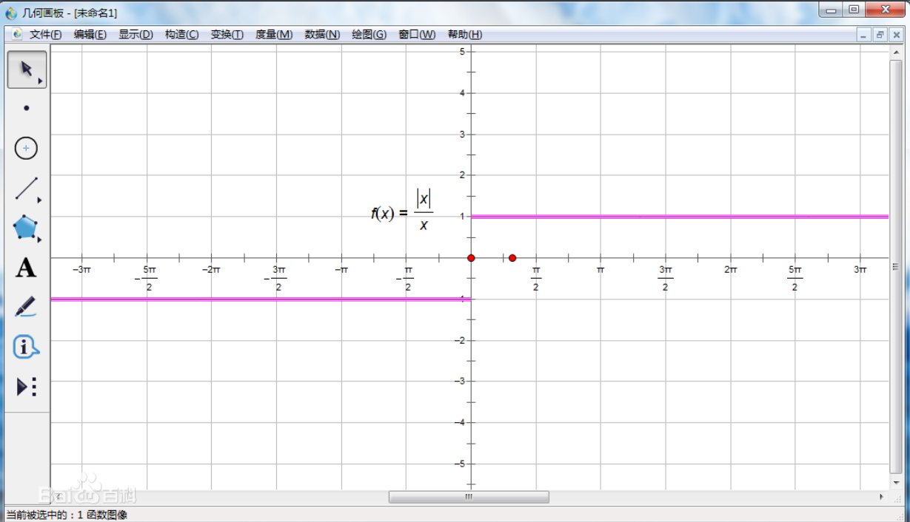
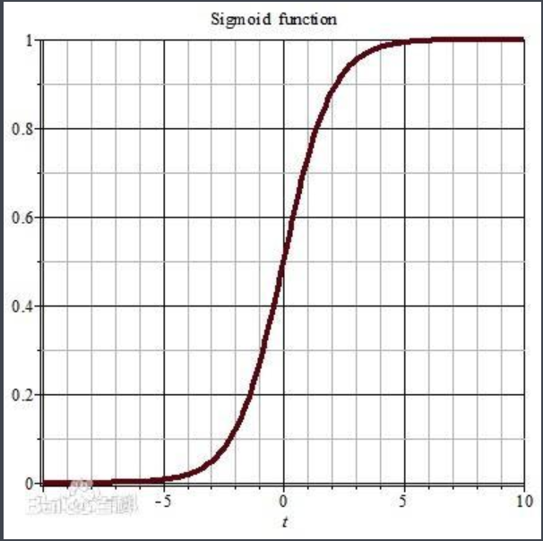
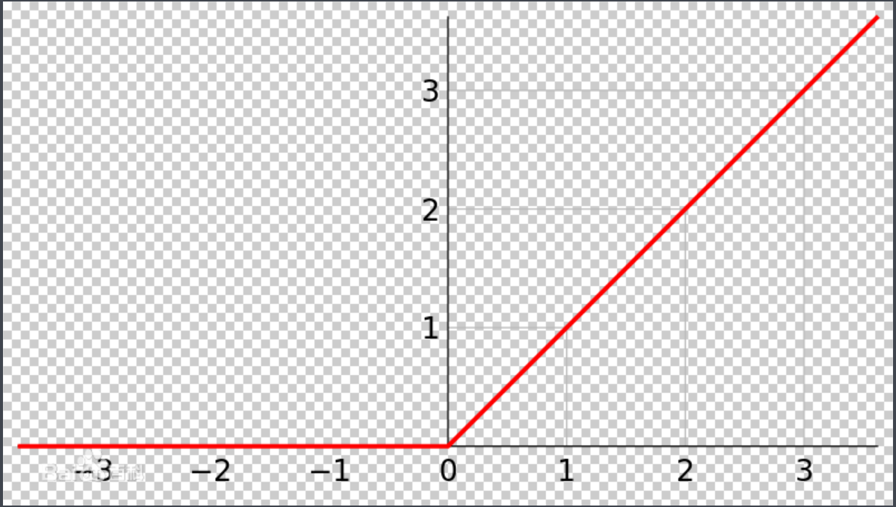
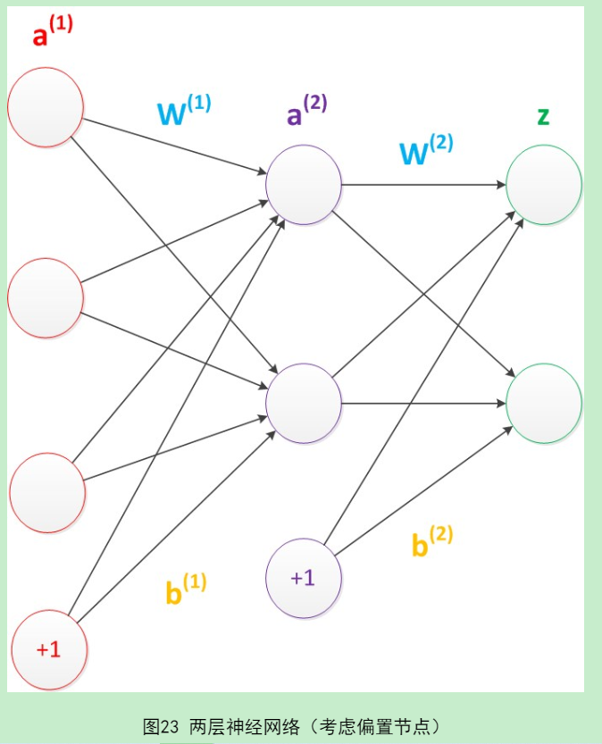
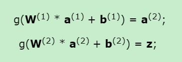
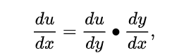
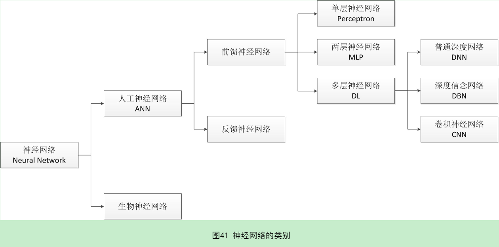

# 神经网络浅讲：从神经元到深度学习
## 神经网络的本质就是通过参数与激活函数来拟合特征与目标之间的真实函数关系。

## 主要学习链接 <https://www.cnblogs.com/subconscious/p/5058741.html> 

偏置项<https://blog.csdn.net/Uwr44UOuQcNsUQb60zk2/article/details/81074408>

梯度下降算法 <https://blog.csdn.net/qq_41800366/article/details/86583789>

反向传播算法 <https://www.cnblogs.com/charlotte77/p/5629865.html>

## 1. 激活函数

### 在单层神经网络时，我们使用的激活函数是sgn函数。

### 到了两层神经网络时，我们使用的最多的是sigmoid函数。

### 而到了多层神经网络时，通过一系列的研究发现，ReLU函数在训练多层神经网络时，更容易收敛，并且预测性能更好。

sgn函数 阶跃函数

sigmoid函数

ReLU函数   线性整流函数（Rectified Linear Unit, ReLU）

反向传播（Backpropagation，BP）算法

## 2. 偏置项
<https://blog.csdn.net/Uwr44UOuQcNsUQb60zk2/article/details/81074408>

### 偏置节点（bias unit）这些节点是默认存在的。它本质上是一个只含有存储功能，且存储值永远为1的单元。在神经网络的每个层次中，除了输出层以外，都会含有这样一个偏置单元。正如线性回归模型与逻辑回归模型中的一样。

### 所以计算变成了

## 3. 隐藏层

### 隐藏层的节点数设计。在设计一个神经网络时，输入层的节点数需要与特征的维度匹配，输出层的节点数要与目标的维度匹配。而中间层的节点数，却是由设计者指定的。因此，“自由”把握在设计者的手中。但是，节点数设置的多少，却会影响到整个模型的效果。如何决定这个自由层的节点数呢？目前业界没有完善的理论来指导这个决策。一般是根据经验来设置。较好的方法就是预先设定几个可选值，通过切换这几个值来看整个模型的预测效果，选择效果最好的值作为最终选择。这种方法又叫做Grid Search（网格搜索）

## 4. 优化

### 优化参数，能够让损失函数的值最小————>优化问题

### 优化一般用梯度下降算法

<https://blog.csdn.net/qq_41800366/article/details/86583789>

### 梯度下降算法
#### 每次计算参数在当前的梯度，然后让参数向着梯度的反方向前进一段距离，不断重复，直到梯度接近零时截止。一般这个时候，所有的参数恰好达到使损失函数达到一个最低值的状态

### 反向传播算法
#### 在神经网络模型中，由于结构复杂，每次计算梯度的代价很大。因此还需要使用反向传播算法。

<https://www.cnblogs.com/charlotte77/p/5629865.html>

## 5.链式法则
### 链式法则是微积分中的求导法则，用于求一个复合函数的导数，是在微积分的求导运算中一种常用的方法。复合函数的导数将是构成复合这有限个函数在相应点的 导数的乘积，就像锁链一样一环套一环，故称链式法则。

## 6.总结

